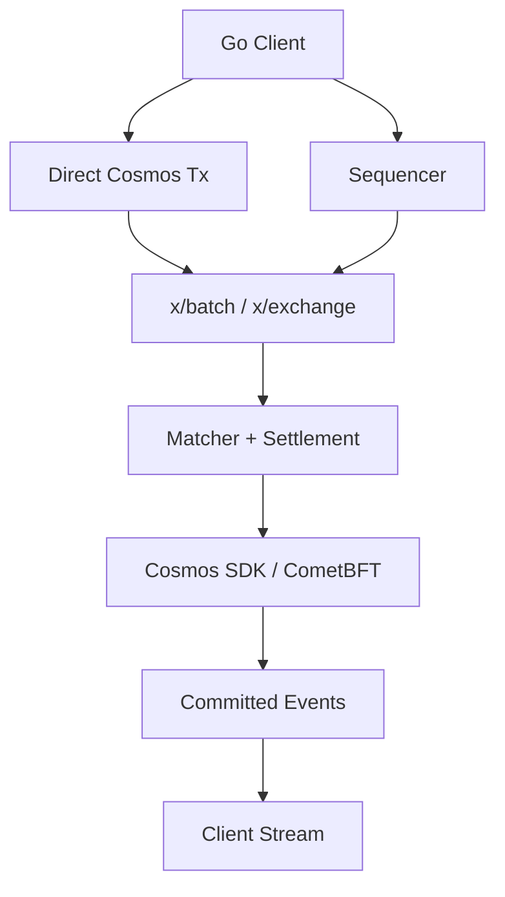

# cosmos-orderbook-engine

Cosmos SDK central limit order book. Prices are integer ticks. Quantities are integer lots. Matching is price-time priority. Validators replay the same match plan. This repository is that engine.

It is not a production deployment. It does not implement fraud proofs, validity proofs, rollup verification, or a decentralized sequencer.



## Implemented

- Deterministic CLOB and price-time matching. The matcher does not import the SDK.
- Reservation, maker-price settlement, buy price improvement, and cumulative maker/taker fees.
- Bank-backed custody. Deposits and withdrawals move coins through one module account. Trades stay inside the exchange ledger.
- Cosmos SDK messages and queries for markets, balances, orders, the book, trades, and the exchange revision.
- One authorized submitter finalizes an ordered batch of owner-signed place and cancel commands. Validators execute the commands. The batch is atomic.
- `BatchID`, `ResultsHash`, and `BatchCommitment`. The commitment chains each batch to the previous one. It is not an exchange state root, a validity proof, or a fraud proof.
- Off-chain sequencer with durable admission order. `POST /v1/commands` is provisional. It is not execution and it is not chain inclusion.
- Prometheus metrics, matcher and storage benchmarks, and bounded retry after a failed batch broadcast.
- Four-validator localnet, invariant checks, failure injection, and deterministic replay.
- Genesis export and import of the live book, balances, sequences, trades, and the batch commitment head.
- Go client for queries, transactions, owner-signed sequencer commands, and committed-event streams.

`pkg/matching` still does not import the SDK.

## Architecture

```text
pkg/domain → pkg/arithmetic → pkg/matching
pkg/canonical → pkg/domain
```

The matcher returns a `MatchPlan`. It does not write state. Asks sort by ascending price, bids sort by `MaxUint64 - price`, and sequence breaks ties in favor of the older order. Details are in [docs/architecture.md](docs/architecture.md), [docs/matching-engine.md](docs/matching-engine.md), and [docs/state-layout.md](docs/state-layout.md).

```text
pkg/domain          orders, sides, sequence, nonce
pkg/arithmetic      checked integer math
pkg/canonical       order IDs, state keys, batch commands, results, commitments
pkg/matching        pure matcher
pkg/matching/memsource
x/exchange          keeper, module, messages, queries
x/batch             ordered batch execution
app                 chain wiring
cmd/cosmos-orderbookd
cmd/orderbook-sequencer
sequencer           admission, journal, batch building, chain submission
client/go           queries, transactions, signed commands, event streams
benchmarks          matcher benchmarks
internal/telemetry  Prometheus recorders
docs                architecture, matching, state layout
```

Ticks, not decimals. A buy of 100 lots at tick 1000 against asks of 30 @ 980, 40 @ 990, and 50 @ 1000 fills 30 @ 980, 40 @ 990, and 30 @ 1000. The incoming remainder is 0. The last maker keeps 20 lots and its original sequence. A UI can render tick 1000 as `10.00`. That rendering is not part of consensus.

## Quick start

```bash
make build
./scripts/localnet.sh
```

The script initializes one validator, funds `alice` with `base` and `bob` with `quote`, and starts the node. Home defaults to `.localnet`. Chain ID is `orderbook-1`. After the node is producing blocks:

```bash
build/cosmos-orderbookd tx exchange deposit 1000base --from alice --chain-id orderbook-1 --keyring-backend test --home .localnet --fees 1stake -y
build/cosmos-orderbookd q exchange markets --home .localnet
```

## Four validators

`scripts/localnet4.sh` starts four validators from one genesis. Home defaults to `.localnet4`. RPC ports are `26657`, `26667`, `26677`, and `26687`. gRPC starts at `29290` and each later node adds 10.

```bash
./scripts/localnet4.sh
./scripts/localnet4.sh stop
./scripts/localnet4.sh reset
./scripts/localnet4.sh smoke
```

`smoke` deposits, matches one trade, and checks that the four nodes report the same exchange state. No batch is submitted, so `query batch latest` is not found on every node.

## Direct order flow

Deposits and withdrawals are normal transactions. Place and cancel use the account command nonce. The first accepted nonce is 1. The chain derives the order ID. A market order takes an explicit worst-price tick. It does not rest.

```bash
build/cosmos-orderbookd tx exchange deposit 1000base --from alice --chain-id orderbook-1 --keyring-backend test --home .localnet --fees 1stake -y
build/cosmos-orderbookd tx exchange deposit 10000quote --from bob --chain-id orderbook-1 --keyring-backend test --home .localnet --fees 1stake -y
build/cosmos-orderbookd tx exchange place-limit-order 1 sell 10 10 1 --from alice --chain-id orderbook-1 --keyring-backend test --home .localnet --fees 1stake -y
build/cosmos-orderbookd tx exchange place-limit-order 1 buy 10 10 1 --from bob --chain-id orderbook-1 --keyring-backend test --home .localnet --fees 1stake -y
build/cosmos-orderbookd q exchange trades 1 --home .localnet
```

`place-market-order` takes the same price argument as the worst acceptable tick.

## Sequencer and batches

`orderbook-sequencer` is off-chain. Validators still execute every command. `POST /v1/commands` returns `provisional: true` after the command is checked and written to the journal. That response does not mean the order executed or that the chain accepted it.

The process reads the latest batch commitment and exchange revision, builds `MsgFinalizeBatch` from the oldest pending positions, and broadcasts it with the Cosmos SDK keyring. The key is not stored in a config file. Commands stay pending if the transaction fails. A nonce that the chain has already consumed is dropped on the next attempt. Finalized commands are not submitted again after a restart.

```bash
make build
./scripts/localnet.sh
```

In another shell, after the node is producing blocks:

```bash
./build/orderbook-sequencer --home .localnet --from submitter --chain-id orderbook-1
```

`--node` defaults to `http://127.0.0.1:26657`. The same values can be set with `ORDERBOOK_NODE`, `ORDERBOOK_CHAIN_ID`, `ORDERBOOK_INSTANCE_ID`, `ORDERBOOK_JOURNAL`, `ORDERBOOK_LISTEN`, `ORDERBOOK_FROM`, `ORDERBOOK_KEYRING_BACKEND`, `ORDERBOOK_HOME`, `ORDERBOOK_MAX_BATCH`, `ORDERBOOK_BATCH_INTERVAL`, `ORDERBOOK_RETRY_INITIAL`, `ORDERBOOK_RETRY_MAX`, `ORDERBOOK_FEES`, and `ORDERBOOK_GAS`.

`POST /v1/commands` takes one JSON command. `chain_id`, `exchange_instance_id`, `owner`, and `client_order_id` are UTF-8 text. `pub_key`, `signature`, and `cancel.order_id` are hex. The signature is over the canonical batch-command bytes, not over this JSON. A client order id or instance id that is not valid UTF-8 is rejected here; this HTTP body does not round-trip arbitrary bytes. `GET /health` reports pending and in-flight counts, the latest observed batch, and chain connectivity. `GET /metrics` is Prometheus text. `GET /v1/pending` lists commands that are not yet finalized.

A failed broadcast waits `--retry-initial` (default 1s) before the next attempt. The wait doubles up to `--retry-max` (default 30s) and resets after a batch is included. The wait does not reorder commands.

## Go client

`client/go` (package `orderbook`) is the external integration layer. A read-only client needs no key. Transaction signing uses a Cosmos SDK keyring signer. The client configuration does not hold a private key.

```go
client, err := orderbook.NewClient(orderbook.Config{
    GRPCEndpoint: "127.0.0.1:9090",
    RPCEndpoint:  "http://127.0.0.1:26657",
    ChainID:      "orderbook-1",
    Fees:         "1stake",
})
market, err := client.GetMarket(ctx, 1)
trades, err := client.SubscribeTrades(ctx, 1)
client.WithSigner(signer)
_, err = client.PlaceLimitOrder(ctx, orderbook.LimitOrder{
    MarketID: 1, Side: domain.SideBuy, TimeInForce: domain.TimeInForceGTC,
    QuantityLots: 1, PriceTicks: 10, CommandNonce: 1,
})
```

Prices and quantities on these calls are integers. `PlaceMarketOrder` requires `WorstPriceTicks`. The client does not invent an order ID. `SignPlaceOrder` and `SignCancelOrder` produce the canonical signed commands the sequencer and `x/batch` already verify. `SequencerClient.Submit` returns provisional admission.

A short `main` is in `client/go/example`.

## Events

The client subscribes to CometBFT `NewBlock` and decodes events already emitted by `x/exchange` and `x/batch`:

- `order_accepted`, `order_partially_filled`, `order_filled`, `order_cancelled`, `order_expired`
- `trade_executed`
- `batch_finalized`

`SubscribeTrades` and `SubscribeOrders` take a market ID. `SubscribeBatches` does not. There is no subscription expression language.

Events from one transaction stay in the order the module emitted them. Expiration events from the block are included with that block. The client does not sort by wall clock.

Delivery across reconnects is at-least-once. A reconnect can show the same event again. `EventID` is the block height, the transaction hash when the event came from a transaction, and the event index. That is enough to deduplicate. The stream is not exactly-once, and it is not protocol state. A stalled subscriber is closed with `ErrSlowConsumer` instead of dropping events or blocking the node.

## Tests

```bash
go test ./...
go test -race ./...
go vet ./...
```

`make check` runs all three. Fuzz targets are included; `go test` executes their seed corpus. A longer run is `go test -fuzz=FuzzMatchReplay -fuzztime=10s ./pkg/matching`.

The client end-to-end test starts an in-process chain. It does not need a manually started node.

## Benchmarks

```bash
make bench-matching   # pure matcher
make bench-storage    # Cosmos-backed order book
make bench-batch      # keeper execution of 100, 1,000, and 10,000 commands
make bench-journal    # append, including fsync, and replay
make bench
```

`make bench-count` repeats each benchmark six times. That output is input for `benchstat`. CPU and heap profiles:

```bash
make profile-cpu
make profile-heap
go tool pprof -top cpu.out
go tool pprof -top mem.out
```

The harness prints `ns/op`, `B/op`, and `allocs/op`. Matcher benchmarks also print `makers/op` and `fills/op`. Storage and batch benchmarks also print `kv_reads/op` and `kv_writes/op`. A batch larger than 128 commands is several atomic `FinalizeBatch` calls. None of these numbers are committed block throughput. Profile files (`cpu.out`, `mem.out`) are not source.

One measurement on this machine, Go 1.27.1, darwin/arm64, Apple M5 Max:

| workload | result |
| --- | --- |
| matcher, one fill | 70.67 ns/op, 104 B/op, 2 allocs/op |
| matcher, 1,000 same-price makers | 52.0 µs/op, 198,256 B/op, 1,011 allocs/op |
| matcher, 10,000 same-price makers | 652 µs/op, 3,813,942 B/op, 10,019 allocs/op |
| matcher, best price does not cross | 56.52 ns/op |
| Cosmos book lookup | 330 ns/op, 1 KV read |
| Cosmos book, match 100 makers | 987 µs/op, 313 KV reads, 407 KV writes |
| batch keeper, 10,000 resting places, one sample | 1.06 s, 120,159 KV reads, 80,000 KV writes |
| journal append, one record, with fsync | 3.44 ms/op |
| journal frame encode, no fsync | 111 ns/op |

## Security model and limitations

Validators re-execute every transaction and every batch. The batch commitment binds a batch to the previous commitment and to its command results. It does not prove the full exchange state.

One genesis address may submit batches. The off-chain sequencer uses that key. Admission order is local journal order. It is not a decentralized sequencer and it is not consensus order until the chain includes the batch.

Event streams observe committed results. They do not decide fills, balances, fees, or batch order. Reconnects can duplicate events.

There is no fraud proof, validity proof, data-availability proof, or production deployment guidance in this repository.

## License

Apache-2.0. See [LICENSE](LICENSE).
